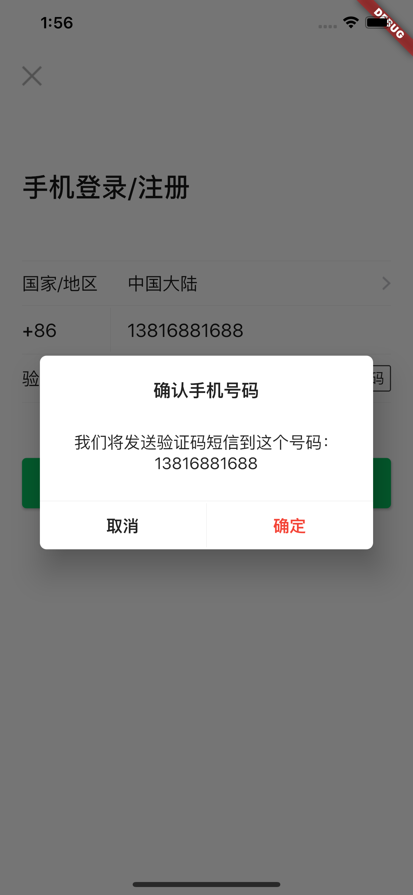

# flutter_wechat
this is  a flutter wechat app.

## Getting Started

This project is a starting point for a Flutter application.

A few resources to get you started if this is your first Flutter project:

- [Lab: Write your first Flutter app](https://flutter.dev/docs/get-started/codelab)
- [Cookbook: Useful Flutter samples](https://flutter.dev/docs/cookbook)

For help getting started with Flutter, view our
[online documentation](https://flutter.dev/docs), which offers tutorials,
samples, guidance on mobile development, and a full API reference.

# 开发标准
- 设计尺寸 750 * 1334 / 2.0
- 即时通信使用长连接

# 界面预览

||||||
|  ----  | ----  | ----  | ----  | ----  |
||||||
||||||
||||||
||||||
||||||
||||||
||||||
||||||
||||||

# 待处理问题
1. 群组相关接口
2. 群组发消息与本地自己发的消息冲突问题
3. 保证群组与联系人的编号不重复